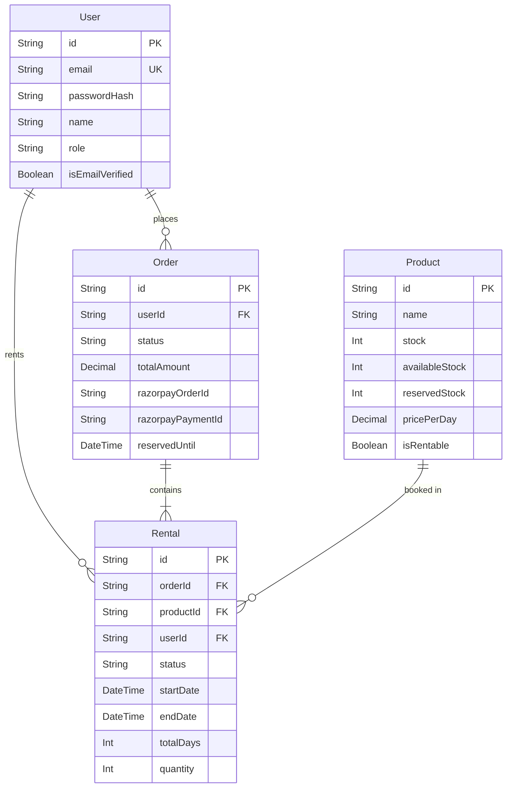

# 🏛️ SmartRent Project Architecture & Engineering Document

This document provides a comprehensive technical overview of SmartRent’s system design, monorepo structure, database schema, concurrency locking, and architectural upgrades.

---

## 📁 1. Monorepo Structure & Networking

SmartRent is structured as a decoupled client-server repository:

```
SmartRent/
 │
 ├── client/                   # Frontend React SPA (Vite, Port 5173)
 │   ├── src/
 │   │   ├── App/
 │   │   │   ├── auth/         # JWT Login & verification views
 │   │   │   ├── customer/     # Store, checkout, profile and history panels
 │   │   │   └── admin/        # CRUD inventories, order lifecycles and analytics
 │   │   ├── components/       # Shared UI buttons, Navbars, and charts
 │   │   └── lib/api.js        # Central Axios instance with JWT interceptors
 │
 └── server/                   # Backend Express API Service (Port 4000)
     ├── src/
     │   ├── auth/             # OTP verifications and cryptographic password hooks
     │   ├── db/               # PostgreSQL Prisma client instance
     │   ├── rentals/          # Invoice generation and inventory locks
     │   ├── reports/          # Optimized analytics reporting engines
     │   └── app.module.js     # Express routes and CORS registry
     ├── prisma/
     │   └── schema.prisma     # Relational database models
```

### 🌐 Cross-Origin Communication & CORS
The frontend and backend communicate via JSON REST APIs. Express permits cross-port cookie transmission by defining explicit origins:
```javascript
app.use(cors({
  origin: 'http://localhost:5173',
  credentials: true
}));
```

### 🔑 Transparent JWT Access Token Rotation
The client maintains authorization in memory via an Axios interceptor registered in `client/src/lib/api.js`. 
If a request encounters a `401 Unauthorized` token expiration response:
1. The request queue is paused.
2. A silent POST request is made to `/auth/refresh` (transmitting the secure, HttpOnly `refreshToken` cookie).
3. On success, the client replaces the invalid authorization headers and replays the original requests transparently.

---

## 📊 2. Database Schema & Relations

SmartRent uses a PostgreSQL database managed via Prisma ORM.

### Entity Relationship Diagram


### Core Relational Guidelines
*   **Cascade Deletion**: Deleting a `User` cascades to delete their `Order` and `Rental` records. Deleting an `Order` cascades to delete its child `Rental` line items.
*   **Restricted Deletions**: Deleting a `Product` is restricted if it is referenced in an existing `Rental` contract.
*   **Database Indexes**:
    *   Index on `Order(reservedUntil, status)` to speed up background cron job cleanup sweeps.
    *   Index on `Order(razorpayOrderId)` and `Order(razorpayPaymentId)` to accelerate payment webhook and verification operations.

---

## 🔒 3. Concurrency, Locking & Stock Safety

SmartRent uses pessimistic locking mechanisms to maintain stock integrity during multi-user checkouts:

### A. Hot Path Efficiency & Short Lock Boundaries
Database row locks are released *before* calling external payment gateway (Razorpay) HTTP APIs. Since Razorpay requests take 200–500ms, holding row locks during this time would block other concurrent checkouts, exhaust connection pools, and lock the database. Immediately committing the order reservation as `PENDING_PAYMENT` releases locks in under 10ms.

### B. Deadlock Elimination (Sorting IDs)
To prevent circular lock wait states, product rows are sorted alphabetically by their IDs before acquiring locks inside database transactions:
```javascript
const sortedIds = items.map(i => i.productId).sort();
```
Since concurrent checkouts lock rows in the exact same alphabetical sequence, cyclic waits (deadlocks) are mathematically impossible.

### C. Pessimistic Row Locking (`FOR UPDATE`)
Rows are locked during checkout checks to ensure availability levels:
```sql
SELECT * FROM "products" WHERE id IN (...) ORDER BY id FOR UPDATE
```

---

## 🛠️ 4. Chronological Engineering Improvements Log

Below is the record of architectural fixes and feature upgrades applied:

### Category & Product Analytics Aggregation
*   **Problem**: Analytics reports executed sequential iteration counts (N+1 queries) for categories, causing CPU loading bottlenecks.
*   **Optimization**: Rewrote queries using database-level `groupBy` and `_sum` aggregations, reducing dashboard latency from multi-second loads down to under 10ms.

### Direct Razorpay Checkout & Window Dismissal
*   **Problem**: Closing the payment overlay modal left frontend loading states spinning infinitely.
*   **Optimization**: Configured client-side `modal.ondismiss` callbacks in Vite parameters to immediately reset frontend loaders and display feedback to the user on modal close.

### Pricing Calculations & Indian Service Tax
*   **Inclusive Day Arithmetic**: Fixed rental period calculations to include both start and end dates: `Math.max(1, Math.ceil((end - start) / (1000 * 60 * 60 * 24)) + 1)`.
*   **Tax Compliance**: Configured a flat 18% GST calculation on checkout subtotals, alongside variable home delivery charges (₹99 vs. ₹0 for store pickups).

### Database Consolidation (PostgreSQL Transition)
*   **Pruned MongoDB**: Removed MongoDB and Mongoose dependencies. Migrated all verification schemas, users, and product catalogs to PostgreSQL, enforcing direct relational integrity checks.

### Automated Stock Return Bug Fix
*   **Problem**: Returning rentals incremented stock by a hardcoded `1`. If a user checked out a quantity of 3, only 1 unit was returned, permanently leaving 2 units lost from inventory.
*   **Fix**: Modified endpoints to dynamically return `rental.quantity` to `availableStock` on item cancellation or return, and added guards preventing duplicate adjustments.
