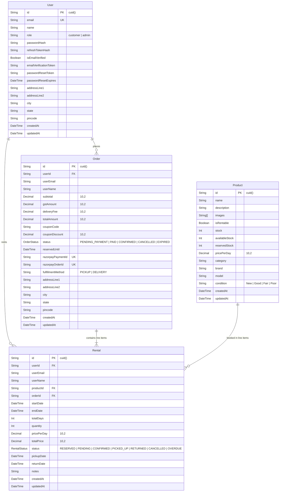
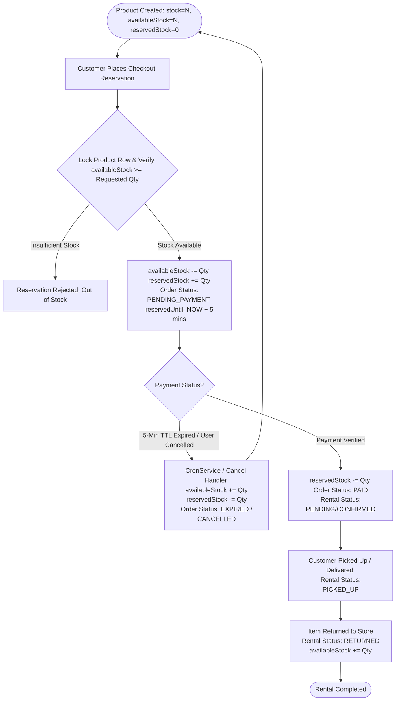
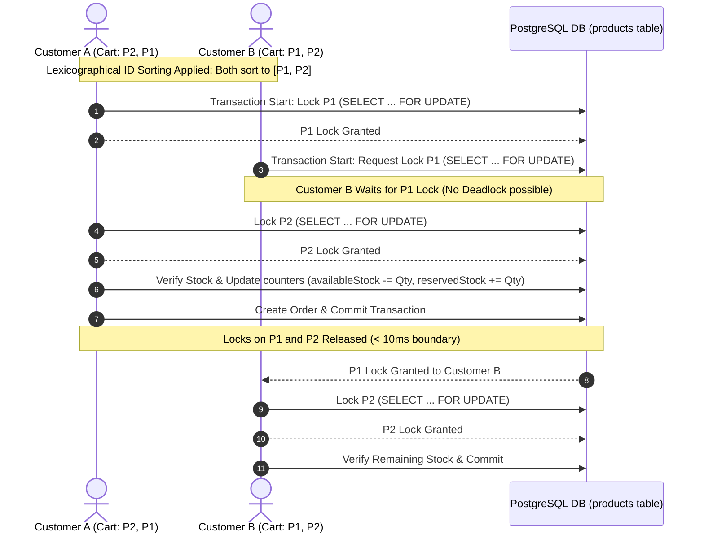

# 📊 Database Schema & Concurrency Guide

This document provides a deep dive into **SmartRent’s** PostgreSQL relational database schema, Prisma ORM models, stock state transitions, pessimistic locking mechanics, and deadlock elimination algorithms.

---

## 🧬 1. Entity Relationship Diagram (ERD)



---

## 📈 2. Stock State Transition Flowchart

The flowchart below demonstrates how stock variables (`availableStock`, `reservedStock`, `stock`) mutate across order and rental lifecycles:



---

## 🔐 3. Concurrency, Locking & Deadlock Elimination

SmartRent handles high-concurrency checkout traffic without race conditions or stock overbooking using PostgreSQL row locking and lexicographical ordering algorithms.



### A. SQL Pessimistic Row Locking (`SELECT FOR UPDATE`)
Inside `RentalsService.createReservation`, products are queried using raw SQL within a transaction (`isolationLevel: ReadCommitted`):
```sql
SELECT * FROM "products" 
WHERE id IN ('cuid_1', 'cuid_2') 
ORDER BY id 
FOR UPDATE
```
This forces PostgreSQL to hold exclusive row locks on the matching product records until the transaction completes, preventing concurrent transactions from modifying `availableStock` simultaneously.

### B. Lexicographical Sorting for Deadlock Elimination
If Customer A attempts to lock `[Product_2, Product_1]` while Customer B attempts to lock `[Product_1, Product_2]`, a circular wait (deadlock) can occur. SmartRent eliminates deadlocks by sorting product IDs alphabetically prior to acquiring locks:
```javascript
const sortedItems = [...items].sort((a, b) => a.productId.localeCompare(b.productId));
```
Because all concurrent checkouts lock products in identical global alphabetical sequence, deadlocks are **mathematically impossible**.

### C. Short Lock Boundaries
Database locks are released **before** invoking external payment APIs (e.g. Razorpay HTTP calls taking 200–500ms). The database transaction commits in **< 10ms**, transitioning the order to `PENDING_PAYMENT` with a 5-minute TTL (`reservedUntil`).

---

## 📋 4. Field-Level Schema Specifications

### `User` Model (`@map("users")`)
| Field Name | Type | Constraints | Description |
| :--- | :--- | :--- | :--- |
| `id` | String | `@id @default(cuid())` | Unique user identifier |
| `email` | String | `@unique` | Customer/Admin email address |
| `name` | String | | Full user name |
| `role` | String | `@default("customer")` | Access role (`"customer"` or `"admin"`) |
| `passwordHash` | String | | Bcrypt password hash |
| `refreshTokenHash`| String? | | Optional hash of refresh token |
| `isEmailVerified` | Boolean | `@default(false)` | Account verification flag |
| `createdAt` | DateTime | `@default(now())` | Account creation timestamp |

### `Product` Model (`@map("products")`)
| Field Name | Type | Constraints | Description |
| :--- | :--- | :--- | :--- |
| `id` | String | `@id @default(cuid())` | Unique product identifier |
| `name` | String | | Catalog item title |
| `stock` | Int | `@default(0)` | Total physical inventory capacity |
| `availableStock` | Int | `@default(0)` | Units available for new bookings |
| `reservedStock` | Int | `@default(0)` | Units currently reserved/rented |
| `pricePerDay` | Decimal | `@db.Decimal(10,2)` | Daily rental rate in INR |
| `category` | String | `@default("")` | Product category grouping |
| `condition` | String | `@default("Good")` | Equipment state (`New`, `Good`, `Fair`, `Poor`) |

### `Order` Model (`@map("orders")`)
| Field Name | Type | Constraints | Description |
| :--- | :--- | :--- | :--- |
| `id` | String | `@id @default(cuid())` | Unique order transaction ID |
| `userId` | String | Foreign Key -> `User.id` | Purchaser user reference |
| `subtotal` | Decimal | `@db.Decimal(10,2)` | Rental subtotal before tax/fees |
| `gstAmount` | Decimal | `@db.Decimal(10,2)` | Computed 18% Goods & Services Tax |
| `deliveryFee` | Decimal | `@db.Decimal(10,2)` | Delivery fee (₹99 for DELIVERY, ₹0 for PICKUP) |
| `totalAmount` | Decimal | `@db.Decimal(10,2)` | Grand total payable |
| `status` | OrderStatus | `@default(PENDING_PAYMENT)` | `PENDING_PAYMENT`, `PAID`, `CONFIRMED`, `CANCELLED`, `EXPIRED` |
| `reservedUntil` | DateTime? | | 5-minute reservation TTL timestamp |
| `razorpayOrderId`| String? | `@unique` | Razorpay gateway order identifier |

### `Rental` Model (`@map("rentals")`)
| Field Name | Type | Constraints | Description |
| :--- | :--- | :--- | :--- |
| `id` | String | `@id @default(cuid())` | Unique rental line item ID |
| `orderId` | String | Foreign Key -> `Order.id` | Parent order reference (`onDelete: Cascade`) |
| `productId` | String | Foreign Key -> `Product.id` | Rented product reference (`onDelete: Cascade`) |
| `userId` | String | Foreign Key -> `User.id` | Renter user reference (`onDelete: Cascade`) |
| `startDate` | DateTime | | Rental start date |
| `endDate` | DateTime | | Rental end date |
| `totalDays` | Int | | Computed rental days |
| `quantity` | Int | `@default(1)` | Number of units booked |
| `status` | RentalStatus | `@default(RESERVED)` | `RESERVED`, `PENDING`, `CONFIRMED`, `PICKED_UP`, `RETURNED`, `CANCELLED`, `OVERDUE` |
