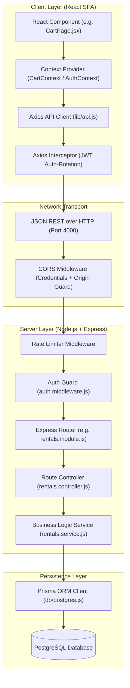

# 📁 Monorepo Architecture & Directory Specifications

This document outlines the directory structure, module responsibilities, state management design, and layer interaction flow for the **SmartRent** monorepo application.

---

## 🏛️ 1. Monorepo Structural Overview

SmartRent is organized into a decoupled client-server architecture containing a **React SPA frontend** (`/client`) and an **Express API backend** (`/server`).

```
SmartRent/
 ├── client/                   # Frontend React Single Page Application (Vite 7)
 ├── server/                   # Backend Node.js REST API Service (Express 5)
 ├── docs/                     # Technical documentation & guides
 └── .github/                  # CI/CD GitHub Actions workflows
```

---

## 🔁 2. Request & Response Layer Interaction Flow

The diagram below details how data flows across all application layers from the browser UI down to PostgreSQL:



---

## 📁 3. Client Monorepo Specifications (`/client`)

### Directory Tree & Module Mapping

```
client/
 ├── public/                   # Static web assets & icons
 ├── src/
 │   ├── App/                  # Next-style App Router View Pages
 │   │   ├── admin/            # Administrative Control Panel Views
 │   │   │   ├── dashboard/    # Metrics & charts dashboard
 │   │   │   ├── orders/       # Order management lifecycle table
 │   │   │   ├── products/     # Inventory product CRUD views
 │   │   │   ├── reports/      # Financial export & category reports
 │   │   │   ├── users/        # Customer account management table
 │   │   │   └── layout.jsx    # Admin layout sidebar & RBAC guard
 │   │   ├── auth/             # Authentication & Verification Views
 │   │   │   ├── login/        # Login page
 │   │   │   ├── signup/       # User registration page
 │   │   │   ├── verify-email/ # OTP verification input page
 │   │   │   └── forgot-password/ # Password reset request page
 │   │   └── customer/         # Customer Rental Store Views
 │   │       ├── cart/         # Shopping cart view
 │   │       ├── checkout/     # Multi-step checkout (Review, Delivery, Payment, Success)
 │   │       ├── products/     # Catalog search & filtering view
 │   │       ├── profile/      # Customer address & order history
 │   │       ├── rentals/      # Active rental contracts view
 │   │       └── wishlist/     # Saved items wishlist view
 │   ├── components/           # Shared UI Components
 │   │   ├── Navbar.jsx        # Top global navigation bar
 │   │   ├── Footer.jsx        # Global footer
 │   │   └── ProtectedRoute.jsx# Role-based route guard wrapper
 │   ├── contexts/             # Global React State Providers
 │   │   ├── AuthContext.jsx   # Auth token, user state, login/logout handlers
 │   │   ├── CartContext.jsx   # Multi-item cart storage & calculation state
 │   │   └── WishlistContext.jsx# Favorite item persistence state
 │   ├── lib/
 │   │   └── api.js            # Axios instance with 401 silent JWT refresh interceptor
 │   ├── pages/                # Standalone Views
 │   │   ├── DashBoardPage.jsx # Customer personal dashboard
 │   │   ├── LandingPage.jsx   # Platform landing page & hero section
 │   │   └── UnauthorizedPage.jsx # 403 Access Denied view
 │   ├── App.jsx               # React Router v7 configuration & Provider hierarchy
 │   └── main.jsx              # Vite entry point
 ├── tailwind.config.js        # Theme colors, container rules, and styling plugins
 └── vite.config.js            # Vite bundler options & Vitest test runner configuration
```

### 🧠 Client State Management
* **`AuthContext`**: Maintains current user session, in-memory `accessToken`, and role permissions.
* **`CartContext`**: Manages cart items, quantity modifiers, rental date ranges, and subtotal estimates.
* **`WishlistContext`**: Handles customer saved items in browser `localStorage`.
* **Axios Interceptor (`lib/api.js`)**: Intercepts `401 Unauthorized` responses to pause requests, trigger silent token renewal via `/auth/refresh`, and retry paused requests automatically.

---

## 📁 4. Server Monorepo Specifications (`/server`)

### Directory Tree & Module Mapping

```
server/
 ├── prisma/
 │   ├── schema.prisma         # Prisma data models & PostgreSQL schema definition
 │   └── migrations/           # Versioned SQL migrations directory
 ├── public/                   # Static invoice assets & branding logo files
 ├── scripts/                  # Command-line database setup & seeder scripts
 │   ├── reset-db.js           # Database truncate script
 │   ├── seed-admin.js         # Default super-admin seeder
 │   ├── seed-products.js      # Mock product catalog seeder
 │   └── verify-setup.js       # Health & connection verification diagnostic
 ├── src/
 │   ├── auth/                 # Authentication & Security Module
 │   │   ├── auth.controller.js# HTTP handlers for auth routes
 │   │   ├── auth.middleware.js# JWT validation & RBAC authorization checks
 │   │   ├── auth.module.js    # Express route mappings
 │   │   ├── auth.service.js   # Password hashing, JWT generation, session rules
 │   │   └── otp.service.js    # OTP generation & terminal fallback printer
 │   ├── config/               # Configuration Module
 │   │   └── configuration.js  # Environment variables parser & fallback loader
 │   ├── db/                   # Database Client Module
 │   │   └── postgres.js       # PrismaClient singleton instance
 │   ├── notifications/        # Email Notification Module
 │   │   └── notifications.service.js # Nodemailer email delivery triggers
 │   ├── orders/               # Order Lifecycle Module
 │   │   ├── orders.contoller.js# Order tracking HTTP handlers
 │   │   ├── orders.module.js   # Order route mappings
 │   │   └── orders.service.js  # Order status updating logic
 │   ├── payments/             # Payment Integration Module
 │   │   ├── payments.controller.js # Razorpay verification handlers
 │   │   ├── payments.module.js # Payment route mappings
 │   │   └── payments.service.js# Razorpay HMAC SHA-256 signature verification
 │   ├── pricing/              # Pricing Engine Module
 │   │   └── pricing.service.js# Inclusive day arithmetic, GST (18%), delivery fee rules
 │   ├── products/             # Inventory Catalog Module
 │   │   ├── products.controller.js # Product CRUD handlers
 │   │   ├── products.module.js# Product route mappings
 │   │   └── products.service.js# Product queries, stock checks, filtering
 │   ├── rentals/              # Core Rental & Reservation Engine
 │   │   ├── cron.service.js   # Background 60s reservation release service
 │   │   ├── pdf.service.js    # PDFKit dynamic invoice generator
 │   │   ├── rentals.controller.js # Reservation & invoice handlers
 │   │   ├── rentals.module.js # Rental route mappings
 │   │   └── rentals.service.js# Pessimistic row locking & reservation transactions
 │   ├── reports/              # Analytics & Aggregation Module
 │   │   ├── reports.contoller.js # Dashboard metrics handlers
 │   │   ├── reports.module.js # Reports route mappings
 │   │   └── reports.service.js# PostgreSQL aggregate queries (groupBy, _sum)
 │   ├── users/                # User Profile Module
 │   │   └── users.controller.js # User role updates & profile handlers
 │   ├── app.module.js         # Express app factory, CORS, static routes, health check
 │   └── main.js               # Server entry point & Cron background service launcher
 └── package.json              # Backend scripts & dependency manifests
```

### 🌐 Cross-Origin Resource Sharing (CORS) Security Model
The server accepts credentials (cookies) exclusively from authorized client origins:
```javascript
app.use(cors({
  origin: process.env.CLIENT_URL || 'http://localhost:5173',
  credentials: true
}));
```
