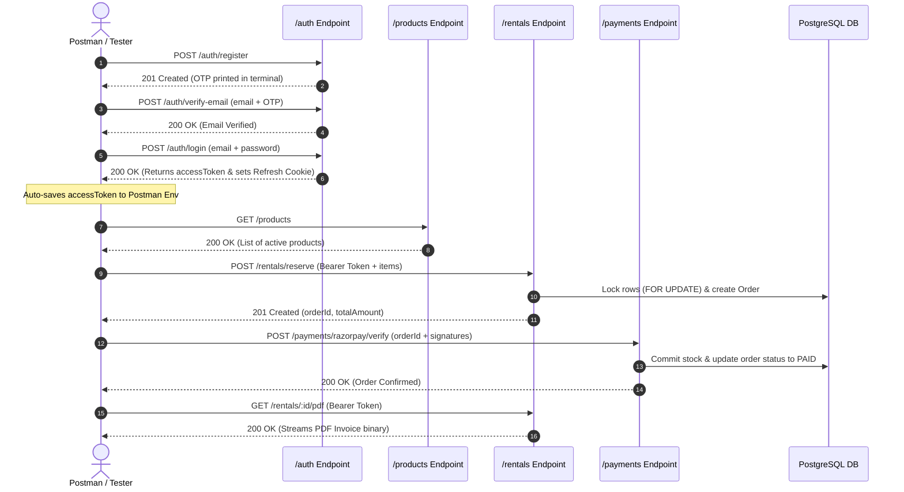

# 📮 REST API & Postman Testing Guide

This document provides a complete guide for testing the **SmartRent API** using Postman or any HTTP client. It includes authentication workflows, visual sequence flowcharts, Postman environment configurations, automatic token extraction scripts, and request/response samples for all API routes.

---

## 🧭 1. API Testing Workflow Overview

The diagram below illustrates the end-to-end testing flow for authenticating, placing an order, and verifying payment via API calls:



---

## ⚙️ 2. Postman Environment Setup

### A. Environment Variables Setup
Create a new Environment in Postman named **`SmartRent Local`** with the following variables:

| Variable Name | Initial Value | Current Value | Description |
| :--- | :--- | :--- | :--- |
| `baseUrl` | `http://localhost:4000` | `http://localhost:4000` | Local server base URL |
| `accessToken` | *empty* | *empty* | Populated automatically on login |
| `adminEmail` | `admin@smartrent.com` | `admin@smartrent.com` | Default admin email |
| `adminPassword` | `admin123` | `admin123` | Default admin password |
| `customerEmail` | `customer@smartrent.com` | `customer@smartrent.com` | Customer test email |
| `customerPassword` | `customer123` | `customer123` | Customer test password |

---

### B. Automatic Token Extraction Script
To automatically extract and set the `accessToken` in your Postman environment after logging in:

1. Open your **Login** request (`POST /auth/login`) in Postman.
2. Select the **Tests** tab.
3. Paste the following JavaScript snippet:

```javascript
// Parse JSON response
const responseData = pm.response.json();

// Validate and set access token in active environment
if (responseData.accessToken) {
    pm.environment.set("accessToken", responseData.accessToken);
    console.log("✅ accessToken successfully saved to environment!");
} else {
    console.warn("⚠️ Login response did not contain an accessToken.");
}
```

---

### C. Authorization Setup for Protected Requests
For all protected routes (Cart, Rentals, Orders, Admin endpoints):
1. In Postman, go to the **Authorization** tab.
2. Select **Type**: `Bearer Token`.
3. Set **Token**: `{{accessToken}}`.

---

## 🔌 3. Endpoint Reference & Sample Payloads

### 🔐 A. Authentication Endpoints

#### 1. Register User
* **HTTP Method**: `POST`
* **URL**: `{{baseUrl}}/auth/register`
* **Auth**: None
* **Request Body (JSON)**:
  ```json
  {
    "email": "customer@smartrent.com",
    "password": "customer123",
    "name": "John Doe",
    "addressLine1": "42 Tech Park Road",
    "city": "Indore",
    "state": "Madhya Pradesh",
    "pincode": "452001"
  }
  ```
* **Success Response (`201 Created`)**:
  ```json
  {
    "ok": true,
    "message": "Registration successful. Please verify your email with the OTP sent.",
    "user": {
      "id": "cuid_user_123",
      "email": "customer@smartrent.com",
      "name": "John Doe",
      "isEmailVerified": false
    }
  }
  ```
  > 💡 **Developer Note**: In local development (`CONSOLE_LOG_OTP=true`), the 6-digit OTP code is printed directly to your server terminal console.

---

#### 2. Verify Email OTP
* **HTTP Method**: `POST`
* **URL**: `{{baseUrl}}/auth/verify-email`
* **Auth**: None
* **Request Body (JSON)**:
  ```json
  {
    "email": "customer@smartrent.com",
    "otp": "123456"
  }
  ```
* **Success Response (`200 OK`)**:
  ```json
  {
    "ok": true,
    "message": "Email verified successfully. You may now log in."
  }
  ```

---

#### 3. User Login
* **HTTP Method**: `POST`
* **URL**: `{{baseUrl}}/auth/login`
* **Auth**: None
* **Request Body (JSON)**:
  ```json
  {
    "email": "customer@smartrent.com",
    "password": "customer123"
  }
  ```
* **Success Response (`200 OK`)**:
  ```json
  {
    "ok": true,
    "accessToken": "eyJhbGciOiJIUzI1NiIsInR5cCI6IkpXVCJ9...",
    "user": {
      "id": "cuid_user_123",
      "email": "customer@smartrent.com",
      "name": "John Doe",
      "role": "customer"
    }
  }
  ```
  *(Saves `refreshToken` into HttpOnly cookie and updates `{{accessToken}}` in Postman).*

---

#### 4. Refresh Access Token
* **HTTP Method**: `POST`
* **URL**: `{{baseUrl}}/auth/refresh`
* **Auth**: Cookie (`refreshToken`)
* **Success Response (`200 OK`)**:
  ```json
  {
    "ok": true,
    "accessToken": "eyJhbGciOiJIUzI1NiIsInR5cCI6IkpXVCJ9..."
  }
  ```

---

### 🏪 B. Catalog & Products Endpoints

#### 1. List Products (Paginated & Filtered)
* **HTTP Method**: `GET`
* **URL**: `{{baseUrl}}/products?page=1&limit=10&category=Cameras&search=Sony`
* **Auth**: Public
* **Success Response (`200 OK`)**:
  ```json
  {
    "products": [
      {
        "id": "prod_camera_01",
        "name": "Sony Alpha A7 IV",
        "description": "Full-frame mirrorless camera",
        "pricePerDay": 1500,
        "availableStock": 5,
        "stock": 5,
        "isRentable": true,
        "category": "Cameras"
      }
    ],
    "pagination": {
      "total": 1,
      "page": 1,
      "pages": 1
    }
  }
  ```

---

### 🛒 C. Reservation & Payments Endpoints

#### 1. Reserve Rental Order (Pessimistic Locking Path)
* **HTTP Method**: `POST`
* **URL**: `{{baseUrl}}/rentals/reserve`
* **Auth**: Bearer Token (`{{accessToken}}`)
* **Request Body (JSON)**:
  ```json
  {
    "items": [
      {
        "productId": "prod_camera_01",
        "startDate": "2026-08-15",
        "endDate": "2026-08-18",
        "quantity": 1,
        "notes": "Include spare battery"
      }
    ],
    "fulfillmentMethod": "DELIVERY",
    "couponCode": "SAVE10",
    "addressLine1": "42 Tech Park Road",
    "city": "Indore",
    "state": "Madhya Pradesh",
    "pincode": "452001"
  }
  ```
* **Success Response (`201 Created`)**:
  ```json
  {
    "id": "order_cuid_99",
    "subtotal": 6000,
    "couponDiscount": 600,
    "gstAmount": 972,
    "deliveryFee": 99,
    "totalAmount": 6471,
    "status": "PENDING_PAYMENT",
    "reservedUntil": "2026-08-11T03:05:00.000Z",
    "rentals": [
      {
        "id": "rent_cuid_01",
        "productId": "prod_camera_01",
        "totalDays": 4,
        "quantity": 1,
        "pricePerDay": 1500,
        "totalPrice": 6000,
        "status": "RESERVED"
      }
    ]
  }
  ```

---

#### 2. Verify Razorpay Payment Signature
* **HTTP Method**: `POST`
* **URL**: `{{baseUrl}}/payments/razorpay/verify`
* **Auth**: Bearer Token (`{{accessToken}}`)
* **Request Body (JSON)**:
  ```json
  {
    "orderId": "order_cuid_99",
    "razorpayPaymentId": "pay_test_123456",
    "razorpayOrderId": "order_rzp_987654",
    "razorpaySignature": "computed_hmac_sha256_hash"
  }
  ```
* **Success Response (`200 OK`)**:
  ```json
  {
    "ok": true,
    "message": "Payment verified successfully",
    "order": {
      "id": "order_cuid_99",
      "status": "PAID",
      "razorpayPaymentId": "pay_test_123456"
    }
  }
  ```

---

#### 3. Download PDF Invoice
* **HTTP Method**: `GET`
* **URL**: `{{baseUrl}}/rentals/order_cuid_99/pdf`
* **Auth**: Bearer Token (`{{accessToken}}`)
* **Response**: Binary PDF file stream (`Content-Type: application/pdf`).

---

### 🛡️ D. Admin Endpoints

#### 1. Fetch Analytics Metrics Dashboard
* **HTTP Method**: `GET`
* **URL**: `{{baseUrl}}/reports/analytics`
* **Auth**: Bearer Token (Admin User)
* **Success Response (`200 OK`)**:
  ```json
  {
    "summary": {
      "totalRevenue": 245000,
      "activeRentals": 12,
      "totalUsers": 85,
      "totalProducts": 100
    },
    "categoryBreakdown": [
      {
        "category": "Cameras",
        "revenue": 120000,
        "rentalCount": 24
      }
    ]
  }
  ```
